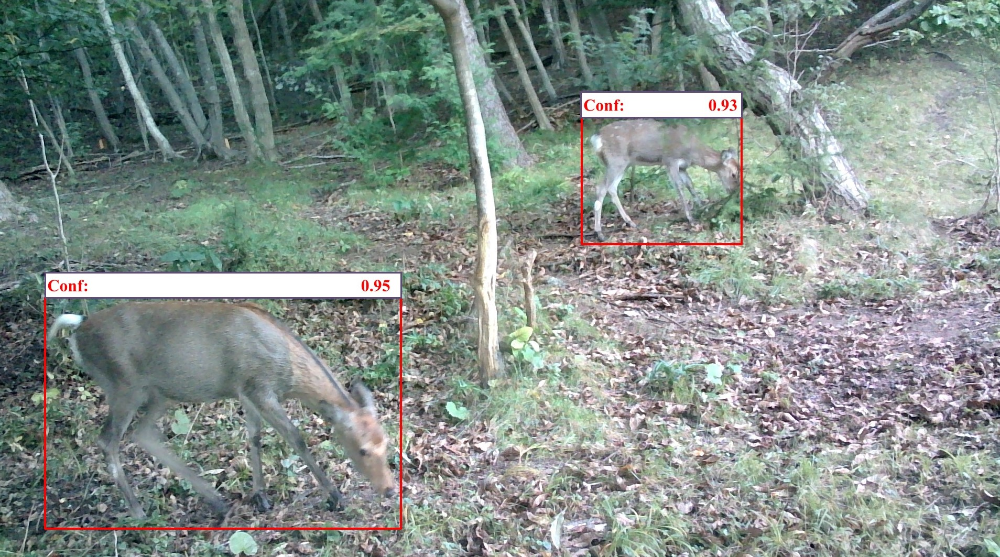
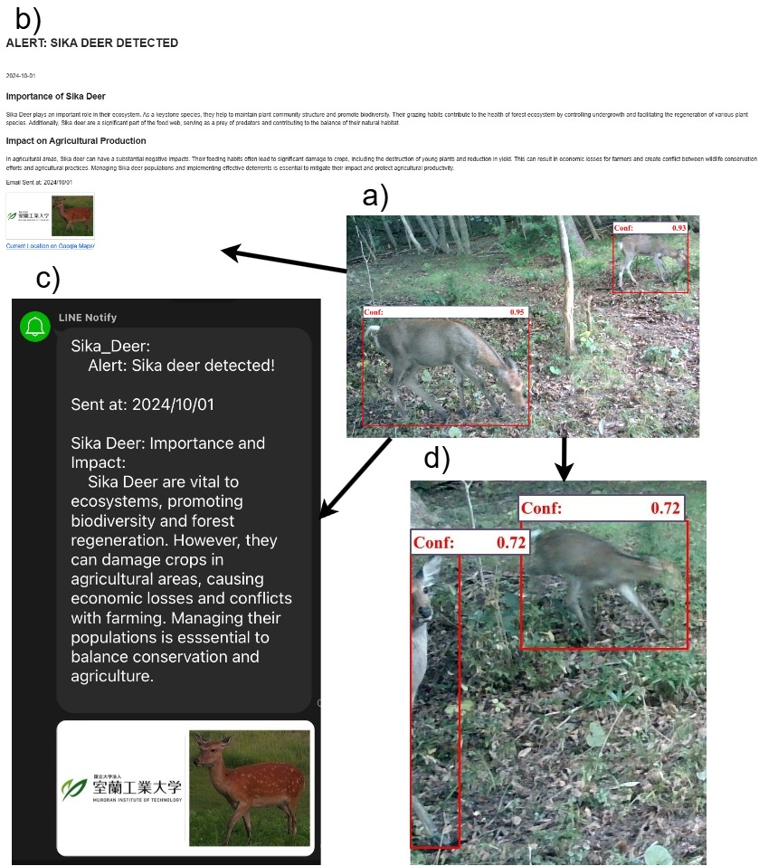

__Muroran IT: "Developing an Alert System for Agricultural Protection: Sika Deer Detection Using Raspberry Pi"__

**Real-Time Sika Deer Detection**
We deployed a fine-tuned sika deer detection model, based on YOLOv8 nano, onto a Raspberry Pi and positioned it in the field for real-time sika deer detection. Two herds of sika deer were detected: Herd 1 consisted of three individual sika deer, while Herd 2 consisted of two individual sika deer.

    

    

**Automated Notification and Alert System**
Upon detecting sika deer, we automated the system to notify locals of sika deer visits via email and the LINE application. Additionally, we implemented an automated buzzer to deter the sika deer from the deployment area.

    

   

**Sensor Connection**
To monitor the micro-environmental conditions affecting sika deer distribution, set up a DHT11 sensor to measure temperature and humidity on GPIO pin 26 of the Raspberry Pi. Additionally, connect a PIR sensor to GPIO pin 22 for motion detection. Control the Raspberry Pi's functions using a button connected to GPIO pin 13.

**Implementation**
This research requires Python version 3.7.13 or higher. To develop the sika deer detection model, use train.ipynb for training and detect.yaml for configuration. First, split the sika deer images into training and testing datasets, then run the detection code in train.ipynb. After training, integrate the model into send_alert_messages.py, connecting it to the sender email and server for alerts. Deploy all code files on the Raspberry Pi, and execute the complete program using run_file.py.
